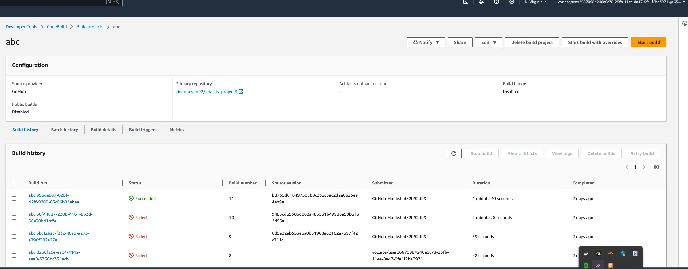
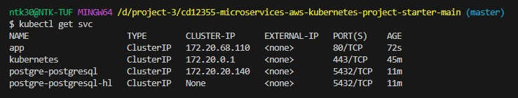
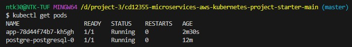
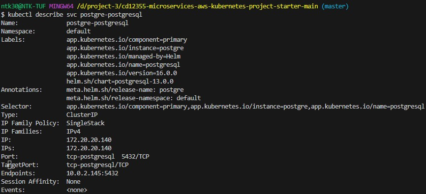
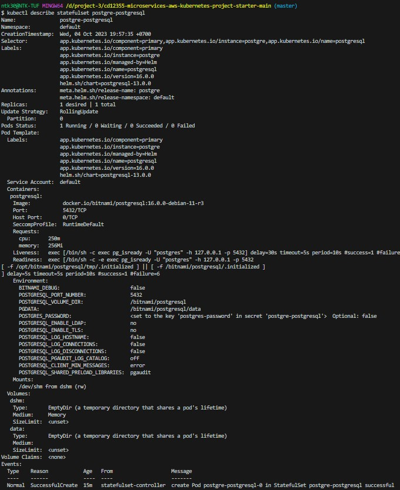
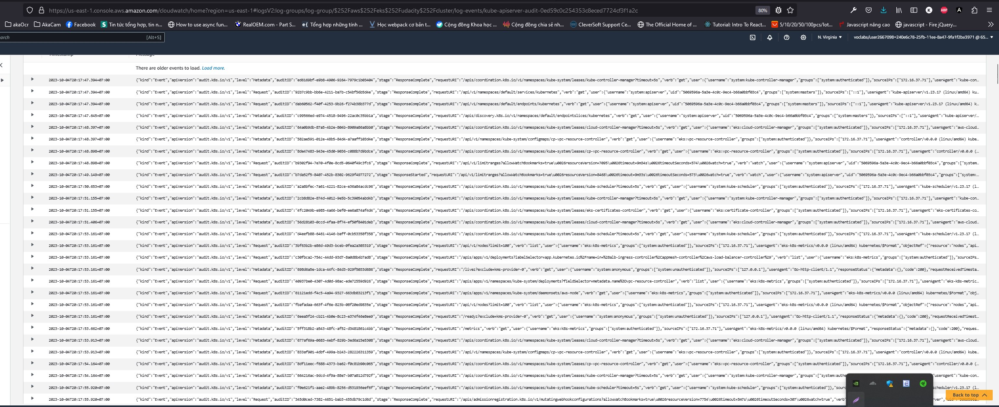

# Coworking Space Service Extension
The Coworking Space Service is a set of APIs that enables users to request one-time tokens and administrators to authorize access to a coworking space. This service follows a microservice pattern and the APIs are split into distinct services that can be deployed and managed independently of one another.

For this project, you are a DevOps engineer who will be collaborating with a team that is building an API for business analysts. The API provides business analysts basic analytics data on user activity in the service. The application they provide you functions as expected locally and you are expected to help build a pipeline to deploy it in Kubernetes.

## Setup

### 1. Create EKS cluster
```cmd
cd eks
terraform init
terraform apply --auto-approve
```

### 2. Install application
```cmd
kubectl apply -f analytics/
```

### 3. Configure a Database
Set up a Postgres database using a Helm Chart.

1. Set up Bitnami Repo
```bash
helm repo add bitnami https://charts.bitnami.com/bitnami
```

2. Install PostgreSQL Helm Chart
```
helm install postgre bitnami/postgresql --set primary.persistence.enabled false
```

By default, it will create a username `postgres`. The password can be retrieved with the following command:
```bash
export POSTGRES_PASSWORD=$(kubectl get secret --namespace default postgre-postgresql -o jsonpath="{.data.postgres-password}" | base64 -d)

echo $POSTGRES_PASSWORD
```

3. Test Database Connection
```bash
kubectl port-forward --namespace default svc/postgre-postgresql 5432:5432 &
    PGPASSWORD="$POSTGRES_PASSWORD" psql --host 127.0.0.1 -U postgres -d postgres -p 5432
```

4. Run Seed Files
We will need to run the seed files in `db/` in order to create the tables and populate them with data.

```bash
kubectl port-forward --namespace default svc/postgre-postgresql 5432:5432 &
    PGPASSWORD="$POSTGRES_PASSWORD" psql --host 127.0.0.1 -U postgres -d postgres -p 5432 < db/1_create_tables.sql 
kubectl port-forward --namespace default svc/postgre-postgresql 5432:5432 &
    PGPASSWORD="$POSTGRES_PASSWORD" psql --host 127.0.0.1 -U postgres -d postgres -p 5432 < db/2_seed_users.sql
kubectl port-forward --namespace default svc/postgre-postgresql 5432:5432 &
    PGPASSWORD="$POSTGRES_PASSWORD" psql --host 127.0.0.1 -U postgres -d postgres -p 5432 < db/3_seed_tokens.sql
```

## Deliverables
1. [`Dockerfile`](./analytics/Dockerfile) 
2. Screenshot of AWS CodeBuild pipeline 

    

3. Screenshot of AWS ECR repository for the application's repository

    

4. Screenshot of `kubectl get svc`

    

5. Screenshot of `kubectl get pods`

    

6. Screenshot of `kubectl describe svc postgre-postgresql`

    

7. Screenshot of `kubectl describe statefulset postgre-postgresql`

    

8. All Kubernetes config files used for deployment. Refer to [deployments diretory](./deployments/)
9. Screenshot of AWS CloudWatch logs for the application

    

10. This `README.md` file